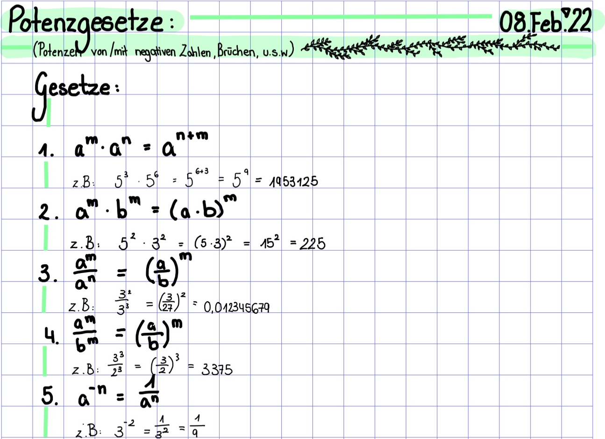
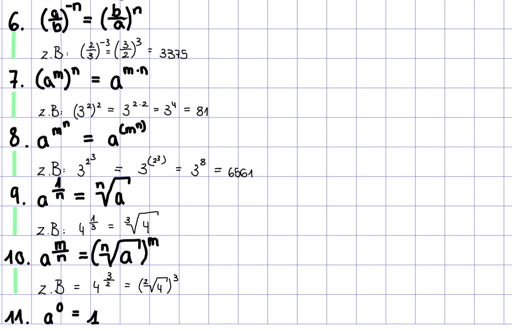
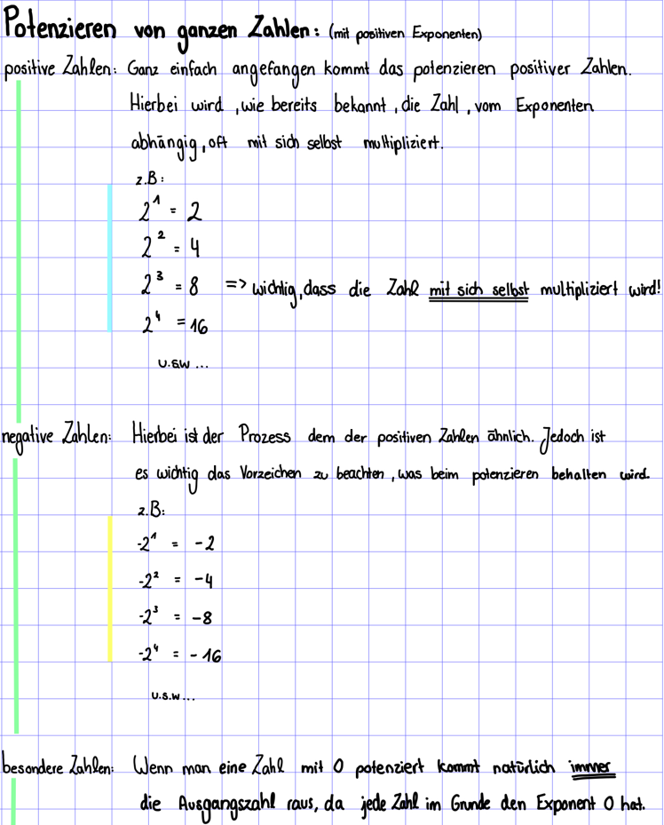
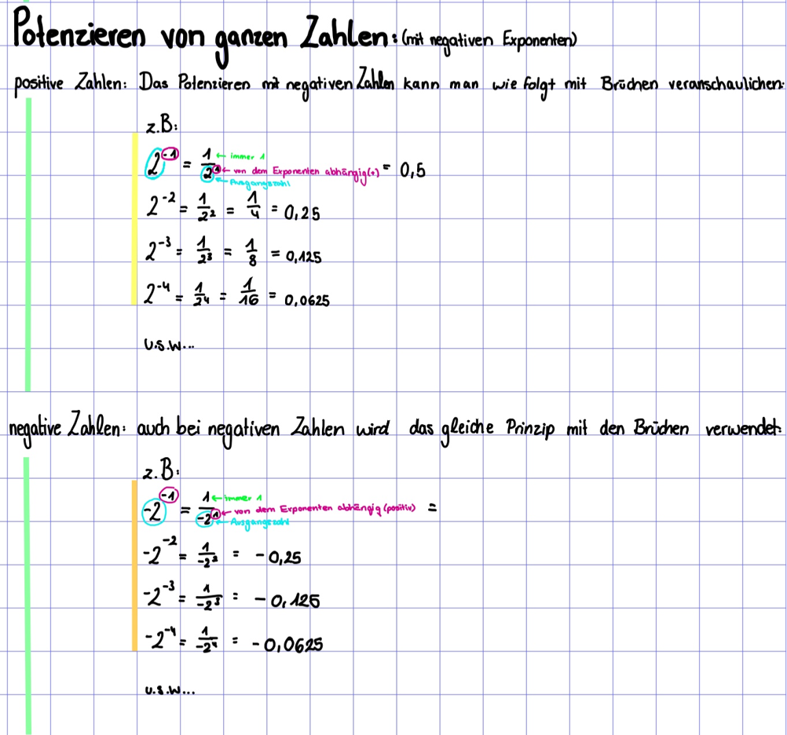
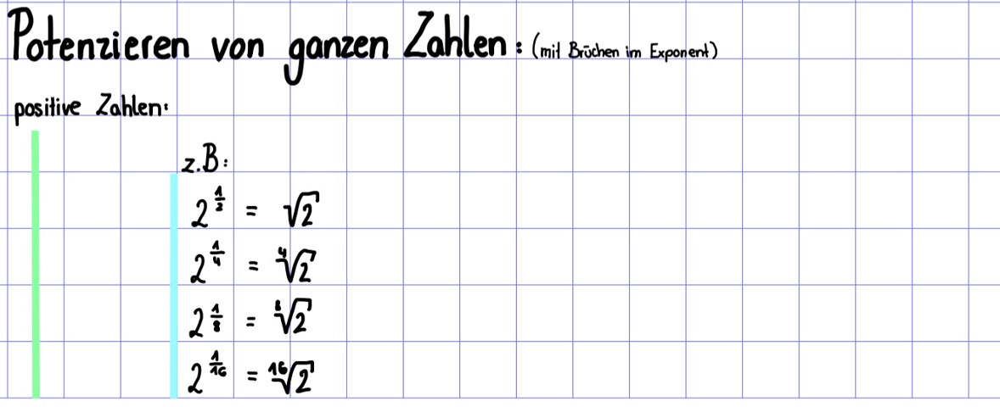
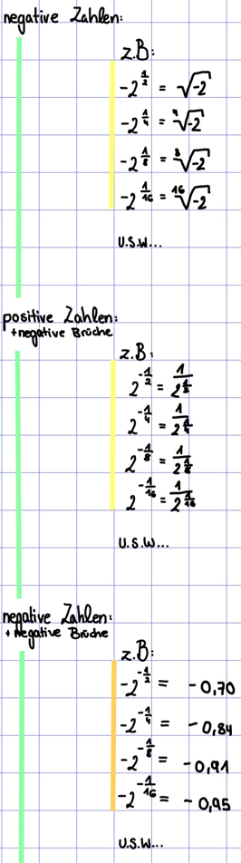
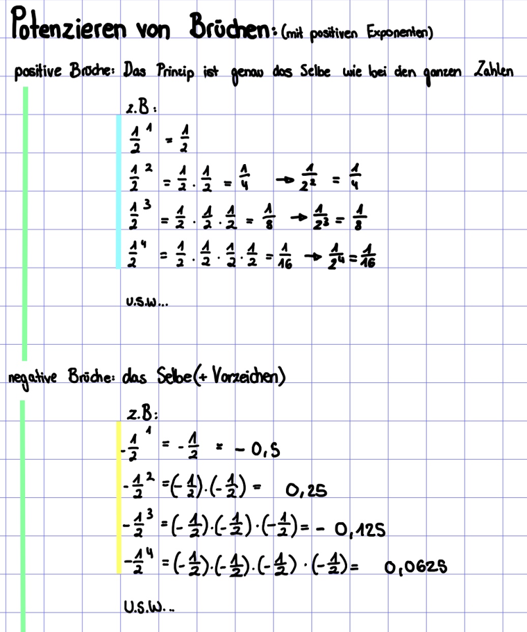
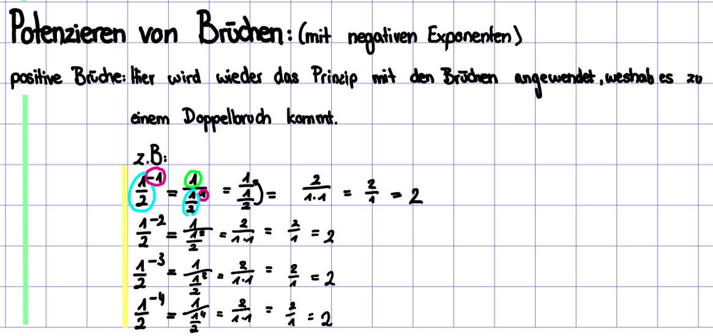
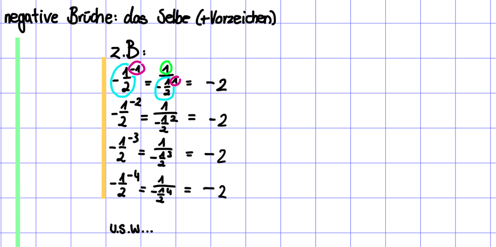

## Potenzieren von ganzen Zahlen

### Positiver Exponent

### Negativer Exponent

### Brüche im Exponent

## Potenzieren von Brüchen

### Positiver Exponent

### Negativer Exponent

## Zusammenfassung

